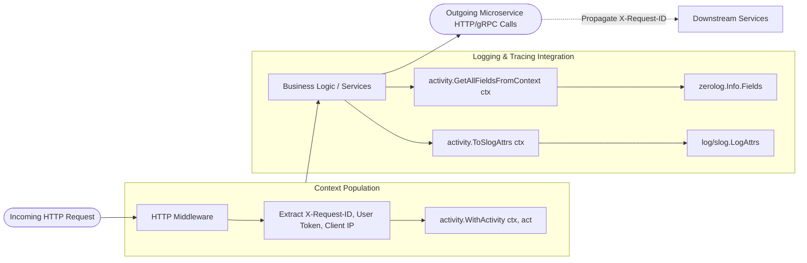

# Activity Helper (`/activity`)

Context-based request metadata propagation designed for end-to-end tracing and structured logging across microservices.

## 🚀 Key Features

- **Context-Bound Metadata**: Thread-safe storage and propagation of `request_id`, `correlation_id`, `user_id`, `user_ip`, and arbitrary custom key-value pairs.
- **Dual Logger Support**: Seamless zero-allocation conversion into **Zerolog** fields and Go 1.21+ **`log/slog`** attributes (`slog.Attr`).
- **No Global State**: Strictly scopes values to the request lifecycle via `context.Context`.

---

## 📡 Metadata Propagation Flow (Data Flowchart)



---

## 📖 Quickstart & Examples

### 1. Storing Metadata in Context

```go
import (
	"context"
	"github.com/Jkenyut/nvx-go-helper/activity"
)

// Inject individual fields:
ctx := activity.WithRequestID(r.Context(), "req-12345")
ctx = activity.WithCorrelationID(ctx, "corr-abc-789")
ctx = activity.WithUserID(ctx, "user-999")
ctx = activity.WithUserIP(ctx, "203.0.113.195")

// Or inject a batch activity struct:
ctx = activity.WithActivity(ctx, activity.Activity{
	RequestID:     "req-12345",
	CorrelationID: "corr-abc-789",
	UserID:        "user-999",
	UserIP:        "203.0.113.195",
})
```

### 2. Structured Logging with slog or Zerolog

```go
// Native Go log/slog (zero allocations):
attrs := activity.ToSlogAttrs(ctx)
slog.LogAttrs(ctx, slog.LevelInfo, "transaction initiated", attrs...)

// Zerolog:
fields := activity.GetAllFieldsFromContext(ctx)
log.Info().Fields(fields).Msg("user action processed")
```
