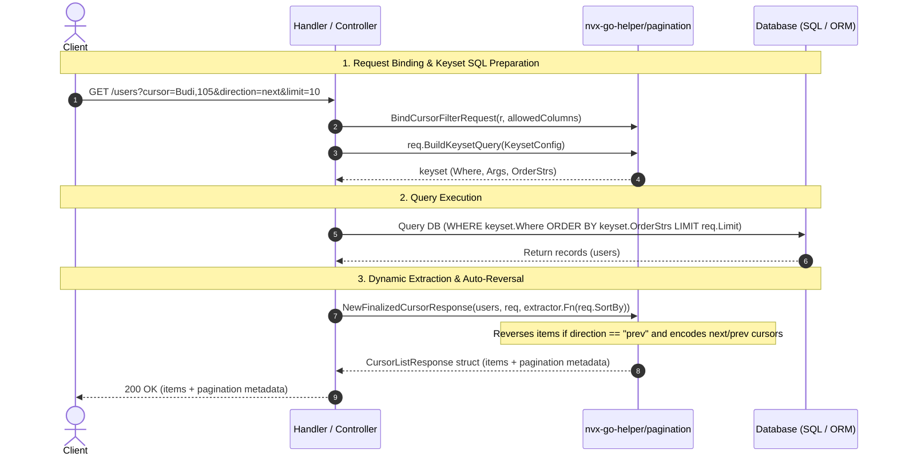

# Pagination Helper (`/pagination`)

Production-ready, bidirectional keyset (cursor) and traditional offset pagination for Go REST APIs. Zero dependencies, type-safe generic responses, whitelisted column filtering, and protection against large query DoS attacks.

## 🚀 Key Capabilities

- **Bidirectional Dynamic Keyset (Cursor):** Supports dynamic multi-column sorting (e.g., `sort_by=status,created_at`) with automatic SQL operator inversion (`<` / `>`) and tie-breaker safety.
- **Traditional Offset-Based:** Sanitized `page` and `limit`, safe SQL `Offset()` calculation, and zero ghost-page bugs.
- **Unified Mode:** Supports both pagination styles in a single endpoint with automatic detection.
- **Smart Filtering & Search:** Parses grouped filters (`?filter=status:active,pending`) and direct query parameters (`?status=active`) with SQL injection protection via `allowedFilters` whitelisting.
- **Generic Responses:** Standardized `ListResponse[T]`, `CursorListResponse[T]`, and `UnifiedListResponse[T]` with RFC-compliant metadata.

---

## 📖 Quickstart & Patterns

### 1. Traditional Offset Pagination

Ideal for admin dashboards and tables requiring jump-to-page navigation.

```go
import "github.com/Jkenyut/nvx-go-helper/pagination"

// 1. In Handler: Extract pagination + filters safely
allowedFilters := map[string]string{
	"status": "users.status",
	"role":   "roles.name",
}
req := pagination.BindOffsetFilterRequest(r, allowedFilters)

// 2. In Repository: Calculate safe SQL offset and limit
totalCount := 150
pageData := req.Pagination(totalCount)

// db.Limit(pageData.Limit).Offset(pageData.Offset())
// if req.HasFilter("users.status") { ... }

// 3. In Response: Wrap into standardized generic response
resp := pagination.NewListResponse(users, pageData)
response.OK(ctx, "success", resp)
```

**JSON Output:**
```json
{
  "items": [...],
  "pagination": {
    "page": 2,
    "limit": 10,
    "total": 150,
    "total_pages": 15,
    "has_next": true,
    "has_prev": true,
    "next_page": 3,
    "prev_page": 1
  }
}
```

---

### 2. Dynamic Keyset Cursor Pagination

Ideal for infinite scrolling, mobile feeds, and high-performance, high-volume datasets (eliminates `OFFSET` bottlenecks).

#### 🔄 Keyset Cursor Lifecycle (Sequence Diagram)



```go
import "github.com/Jkenyut/nvx-go-helper/pagination"

// 1. In Handler: Binds query params and decodes cursor
allowedColumns := map[string]string{
	"name":       "user_name",
	"created_at": "user_created_at",
}
req := pagination.BindCursorFilterRequest(r, allowedColumns)

// 2. In Repository: Generate SQL sort, operators, and keyset WHERE condition in ONE call
keyset, err := req.BuildKeysetQuery(pagination.KeysetConfig{
	AllowedColumns: allowedColumns,
	UniqueColumn:   "user_id", // Mandatory tie-breaker to prevent skipped rows
	UniqueSortType: "DESC",
})
if err != nil {
	// Handle cursor error if any
}

// Execute query:
// if keyset.HasWhere() { q = q.Where(keyset.Where, keyset.Args...) }
// for _, order := range keyset.OrderStrs { q = q.OrderBy(order) }
// q = q.Limit(req.Limit)

// 3. In Service / Handler: Configure extractor and finalize response
extractor := pagination.NewFieldExtractor(map[string]func(u User) any{
	"name":       func(u User) any { return u.Name },
	"created_at": func(u User) any { return u.CreatedAt },
}, func(u User) any { return u.ID })

// Automatically handles backward array reversal and generates bidirectional next/prev cursors:
resp := pagination.NewFinalizedCursorResponse(users, req.DynamicCursorRequest, extractor.Fn(req.SortBy))
response.OK(ctx, "success", resp)
```

**JSON Output (Human-Readable Keyset Cursor):**
```json
{
  "items": [...],
  "pagination": {
    "limit": 10,
    "next_cursor": "App X,105",
    "prev_cursor": "App A,10",
    "has_next": true
  }
}
```

> [!TIP]
> **Readable & Single-Value Cursors**: Keyset cursors are directly human-readable and URL-friendly without unnecessary Base64 layers (e.g. `?cursor=105` for single-column keyset or `?cursor=App X,105` for composite keysets). Cursors containing commas or quotes are safely escaped.


---

### 3. Unified Mode (Hybrid Endpoint)

Allow API consumers to choose either offset (`?page=2&limit=20`) or cursor (`?cursor=xyz&direction=next` or `?pagination=cursor` or `?mode=cursor`) within the same endpoint:

```go
// 1. In Handler: Extract pagination + filters safely in a single pass
req := pagination.BindUnifiedFilterRequest(r, allowedFilters, 100)

if req.IsCursor {
	// 2a. Keyset cursor logic:
	// - Eliminates COUNT(*) DB overhead
	// - Optional TypeDetector auto-casts cursor tokens to SQL types (e.g. integer, uuid)
	keyset, err := req.BuildKeysetQuery(pagination.KeysetConfig{
		AllowedColumns: allowedColumns,
		UniqueColumn:   "id",
		Detector:       pagination.NewTypeDetector().WithIntegerSuffixes("id"),
	})
	// Query DB using keyset.Where, keyset.Args, keyset.OrderStrs, req.GetLimit()...

	// Return standardized cursor response with auto-reversal on 'prev':
	resp := pagination.NewUnifiedFinalizedCursorResponse(users, req, extractor.Fn(req.GetSortBy()))
	response.OK(ctx, "success", resp)
} else {
	// 2b. Traditional offset logic:
	// - Use COUNT(*) only for offset mode
	totalCount := 150
	pageData := req.Pagination(totalCount)
	// Query DB using req.GetLimit(), req.Offset()...

	// Wrap into uniform UnifiedListResponse[T]:
	resp := pagination.NewUnifiedOffsetResponse(users, pageData)
	response.OK(ctx, "success", resp)
}
```

> [!TIP]
> **Unified Return Type**: Both branches return `pagination.UnifiedListResponse[T]`. This allows Service and Repository layers to maintain a strong, concrete return type rather than resorting to `any` or separate duplicate DTOs.
> If using `ListResponse[T]` or `CursorListResponse[T]`, you can convert them directly with `.ToUnified()`.


---

## 🛠️ Filter & Query Parameter Syntax

The binder automatically processes and normalizes two common query parameter styles:

1. **Grouped Syntax:**
   ```
   GET /users?filter=status:active,pending&filter=role:admin
   ```
2. **Direct Syntax:**
   ```
   GET /users?status=active,pending&role=admin
   ```

### Safety & Features:
- **SQL Injection Safe:** Only parameters listed in `allowedFilters` are parsed.
- **Automatic Deduplication:** Duplicate values in a column are collapsed into unique slices.
- **Search Support:** Reads `?search=term` via `req.Search`.
- **Max Limit Protection:** Caps client-requested limits to prevent database strain (e.g. `BindOffsetFilterRequest(r, allowedFilters, 50)`).
- **Convenient Filter Helpers:**
  ```go
  if req.HasFilter("users.status") {
  	statuses := req.GetFilter("users.status")           // []string{"active", "pending"}
  	primaryStatus := req.GetFirstFilter("users.status") // "active"
  }
  ```

---

## 🛡️ Database Column Type Normalization

HTTP query parameters and JSON cursor strings are naturally string-typed (`"true"`, `"1,2,3"`, `"2026-09-05T00:00:00Z"`). Passing raw strings to database drivers (PostgreSQL, MySQL, SQLite) often causes type mismatches or prevents indexes from being used.

The `pagination` package provides automatic database type normalization:

```go
// Normalize filter values based on detected column type (integers, booleans, timestamps, UUIDs, dates, etc.)
val, err := req.NormalizedFilterValue("users.is_active") // returns bool(true)
ids, err := req.NormalizedFilterValue("users.id")        // returns []int64{1, 2, 3}

// Normalize decoded cursor values against sort columns
sqlArgs, err := req.NormalizedCursorValues(sortRes.Columns)
```

### Customizing Type Detection

You can customize type detection rules or override types for specific columns:

```go
detector := pagination.NewTypeDetector().
	WithOverride("custom_code", pagination.TypeString).
	WithSuffixes(pagination.TypeTimestamp, "_at", "_date_time").
	WithTimestampFormats(time.RFC3339, "2006-01-02 15:04:05")

val, err := req.NormalizedFilterValue("custom_code", detector)
```

---

## ⚙️ Under The Hood: Dynamic Keyset Pagination

When multiple rows share the same column value (e.g., duplicate timestamps or statuses), traditional single-column keyset conditions fail.

`pagination.BuildDynamicKeyset` generates mathematically sound nested composite SQL conditions:

```sql
-- For 2 columns (status, id):
(status > ?) OR (status = ? AND id < ?)

-- For 3 columns (status, created_at, id):
(status > ?) OR (status = ? AND created_at > ?) OR (status = ? AND created_at = ? AND id < ?)
```

Combined with automatic operator flipping when navigating backwards (`direction=prev`), this guarantees deterministic, zero-duplicate, and zero-skip pagination at enterprise scale.
