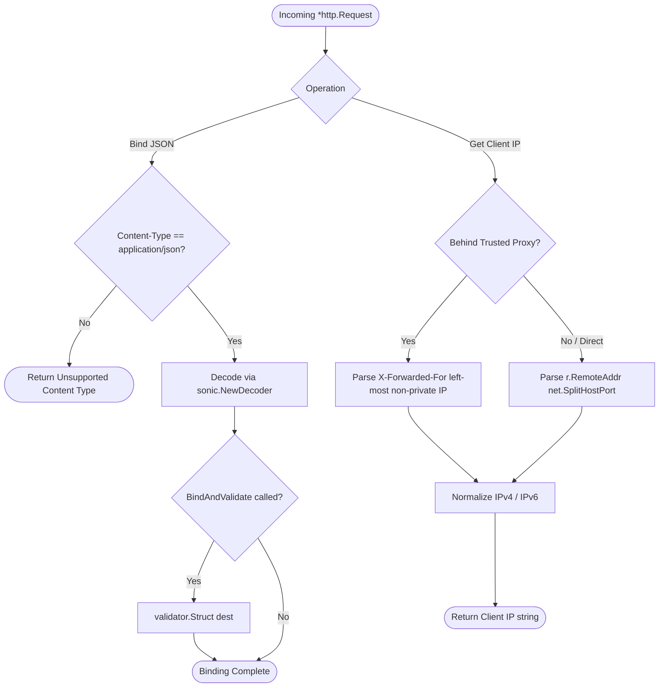

# Request Helper (`/request`)

High-performance HTTP request binding, body-preserving query parameter extraction, and reliable client IP resolution.

## 🚀 Key Features

- **Fast Sonic JSON Binding**: Decodes request bodies into destination structs with `bytedance/sonic`.
- **Integrated Validation**: `BindAndValidate(r, dest)` executes struct tag validation in one call.
- **Safe Query Parsing**: Extracts typed URL queries (`int`, `bool`, `slice`, `uuid`) without consuming the request body stream.
- **Trusted Client IP Resolution**: Resolves true IPv4 / IPv6 client addresses across proxies, CDNs, and load balancers.

---

## 🧭 Request Processing & IP Resolution Flow



---

## 📖 Quickstart & Examples

### 1. JSON Binding & Validation

```go
import "github.com/Jkenyut/nvx-go-helper/request"

type CreateUserRequest struct {
	Name  string `json:"name" validate:"required"`
	Email string `json:"email" validate:"required,email"`
}

var req CreateUserRequest
if err := request.BindAndValidate(r, &req); err != nil {
	// Returns JSON decoding or validation error
}
```

### 2. URL Query Extraction

```go
page := request.GetQueryInt(r, "page", 1)
status := request.GetQueryString(r, "status", "active")
isActive := request.GetQueryBool(r, "is_active", true)
tags := request.GetQuerySlice(r, "tags", []string{"news"})
```

### 3. Client IP Extraction

```go
clientIP := request.GetClientIP(r)
```
