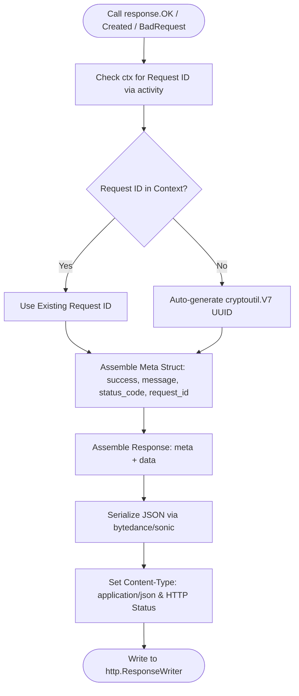

# Response Helper (`/response`)

Unified, predictable, and production-grade JSON API response formatter for Go microservices powered by `bytedance/sonic`.

## 🚀 Key Features

- **Strict Meta & Data Separation**: Client applications receive a predictable contract (`meta` containing status, messages, tracing IDs, and `data` containing the payload).
- **Automatic Request Tracing**: Extracts `request_id` from `context.Context` (via `/activity`) or generates a time-ordered UUID v7 fallback automatically.
- **Lowercase Messaging Standard**: Enforces clean, lowercase status messages (no erratic screaming casing).
- **Hyper-Fast JSON Serialization**: Marshals HTTP payloads using `bytedance/sonic`.

---

## 🏛️ Response Architecture & Lifecycle



---

## 📖 Quickstart & Examples

### 1. Success Responses

```go
import "github.com/Jkenyut/nvx-go-helper/response"

// 200 OK:
response.OK(ctx, "user profile retrieved", userProfile)

// 201 Created:
response.Created(ctx, "order placed successfully", createdOrder)
```

**JSON Output:**
```json
{
  "meta": {
    "success": true,
    "message": "user profile retrieved",
    "status_code": 200,
    "request_id": "0192c84f-7f89-7000-8000-123456789abc"
  },
  "data": {
    "id": 105,
    "name": "Budi"
  }
}
```

### 2. Error Responses

```go
// 400 Bad Request:
response.BadRequest(ctx, "invalid transaction payload", nil)

// 422 Unprocessable Entity (with validation map):
response.UnprocessableEntity(ctx, "validation failed", validationErrorsMap)

// 500 Internal Server Error:
response.InternalServerError(ctx, "failed to process transaction", nil)
```
