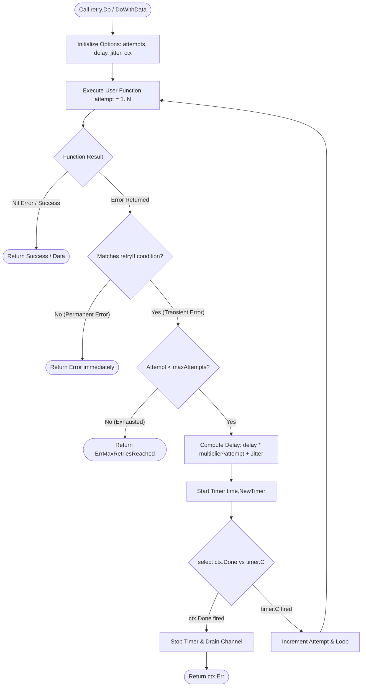

# Retry Helper (`/retry`)

Robust, configurable retry utilities with exponential backoff, randomized jitter, context cancellation awareness, and zero goroutine/timer leaks.

## 🚀 Key Features

- **Exponential Backoff & Jitter**: Avoids thundering herd problems with full jitter algorithms.
- **Context-Aware**: Stops retrying immediately when `ctx.Done()` fires.
- **Leak-Free Timer Hygiene**: Employs clean `time.NewTimer` + `Stop()` with channel draining to prevent timer leaks during high-throughput retries.
- **Conditional Retries**: Selectively retry only on transient errors via `WithRetryIf(fn)`.

---

## 🔁 Retry Execution Logic (Flowchart)



---

## 📖 Quickstart & Examples

### 1. Retrying Simple Operations

```go
import (
	"context"
	"time"

	"github.com/Jkenyut/nvx-go-helper/retry"
)

err := retry.Do(func() error {
	return callExternalPaymentGateway()
},
	retry.WithMaxAttempts(4),
	retry.WithBackoff(100*time.Millisecond, 2.0), // 100ms, 200ms, 400ms...
	retry.WithJitter(0.2),                         // +/- 20% random jitter
	retry.WithContext(ctx),
)
```

### 2. Retrying Operations with Return Data

```go
user, err := retry.DoWithData(func() (*User, error) {
	return fetchUserFromRPC(userID)
},
	retry.WithMaxAttempts(3),
	retry.WithRetryIf(func(err error) bool {
		// Only retry network timeouts, not 404 or auth errors
		return isTemporaryNetworkError(err)
	}),
)
```
