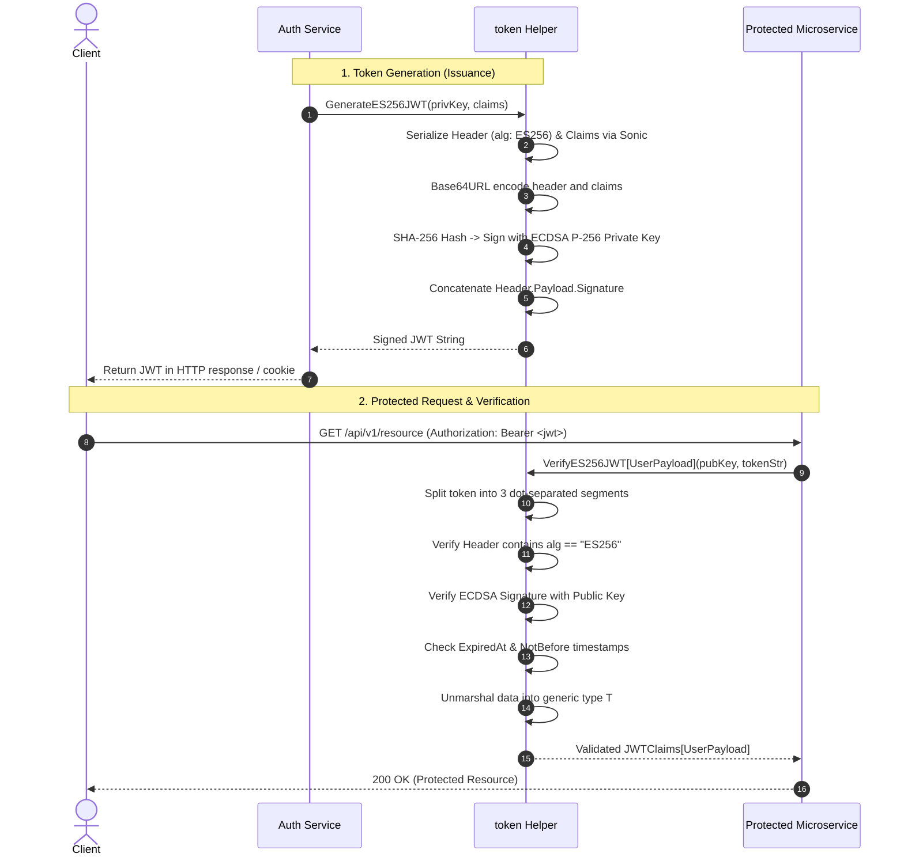

# Token Helper (`/token`)

Lightweight, high-performance JWT signing, verification, and token extraction powered by ECDSA (ES256) and `bytedance/sonic`.

## 🛡️ Key Features

- **Strict ES256 (ECDSA P-256)**: Cryptographically robust, asymmetric signing that completely prevents HMAC `none` or algorithm-confusion attacks.
- **Generic Type-Safe Payloads**: Support for generic `JWTClaims[T]` allowing strongly-typed custom domain payloads in the `data` claim.
- **High-Performance Serialization**: Ultra-fast JSON encoding and decoding via Sonic.
- **Standard RFC 7519 Validation**: Built-in verification for `exp` (expiration), `nbf` (not-before), and key integrity.

---

## 🔄 JWT ES256 Lifecycle (Sequence Diagram)



---

## 📖 Quickstart & Examples

### 1. Generating a Typed JWT

```go
import (
	"crypto/ecdsa"
	"crypto/elliptic"
	"crypto/rand"
	"time"

	"github.com/Jkenyut/nvx-go-helper/token"
)

type UserPayload struct {
	UserID string   `json:"user_id"`
	Roles  []string `json:"roles"`
}

// Generate P-256 key pair (or load from PEM)
privKey, _ := ecdsa.GenerateKey(elliptic.P256(), rand.Reader)

claims := token.JWTClaims[UserPayload]{
	Subject:   "usr_12345",
	ExpiresAt: time.Now().Add(24 * time.Hour).Unix(),
	IssuedAt:  time.Now().Unix(),
	Data: UserPayload{
		UserID: "usr_12345",
		Roles:  []string{"admin", "member"},
	},
}

tokenString, err := token.GenerateES256JWT(privKey, claims)
```

### 2. Verifying and Extracting Claims

```go
pubKey := &privKey.PublicKey

validatedClaims, err := token.VerifyES256JWT[UserPayload](pubKey, tokenString)
if err != nil {
	// Handle token.ErrTokenExpired, token.ErrInvalidSignature, etc.
	return
}

user := validatedClaims.Data
// user.UserID == "usr_12345"
```
