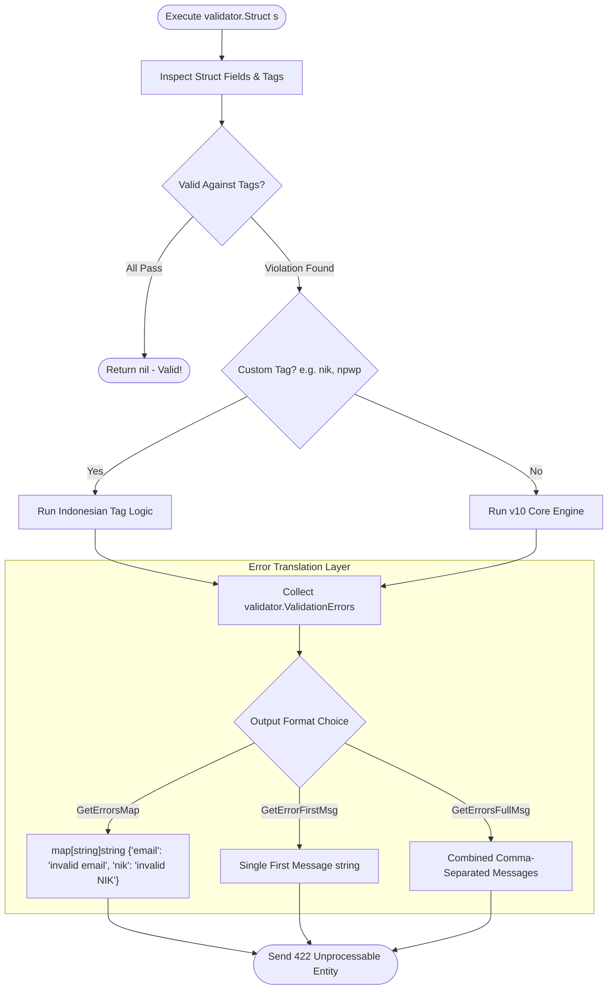

# Validator Helper (`/validator`)

Thread-safe wrapper around `go-playground/validator/v10` providing streamlined struct validation, custom Indonesian national identification validators, and user-friendly error translations designed for REST APIs.

## 🚀 Key Features

- **Custom Indonesian Tags**:
  - `nik`: Validates 16-digit Indonesian National Identity Numbers with province and date encoding rules.
  - `npwp`: Validates Indonesian Tax Identification Numbers (15-digit / 16-digit format).
  - `id_phone`: Validates Indonesian mobile phone numbers (`+62` or `08`).
  - `currency_idr`: Validates Indonesian Rupiah currency formatting.
- **REST-Ready Error Translation**: Automatically maps validation tags to clean, client-facing messages (e.g., `GetErrorsMap(err)` returning a JSON-friendly `map[string]string`).
- **Thread-Safe Registry**: Safely registers custom rules and error messages concurrently.

---

## 🔍 Validation & Translation Flow (Flowchart)



---

## 📖 Quickstart & Examples

### 1. Validating Structs with Custom Tags

```go
import "github.com/Jkenyut/nvx-go-helper/validator"

type CustomerProfile struct {
	FullName string `json:"full_name" validate:"required,min=3"`
	Email    string `json:"email" validate:"required,email"`
	NIK      string `json:"nik" validate:"required,nik"`
	NPWP     string `json:"npwp" validate:"omitempty,npwp"`
	Phone    string `json:"phone" validate:"required,id_phone"`
}

req := CustomerProfile{
	FullName: "Budi",
	Email:    "budi@example.com",
	NIK:      "3201010101900001",
	Phone:    "081234567890",
}

err := validator.Struct(req)
if err != nil {
	// Format errors into a map for JSON response
	errMap := validator.GetErrorsMap(err)
	// Output: {"nik": "invalid NIK format"}
}
```

### 2. Registering Custom Rules

```go
v := validator.New()
_ = v.RegisterCustomValidation("alphanumeric_space", customValidatorFn, "{0} must contain only letters, numbers, and spaces")
```
