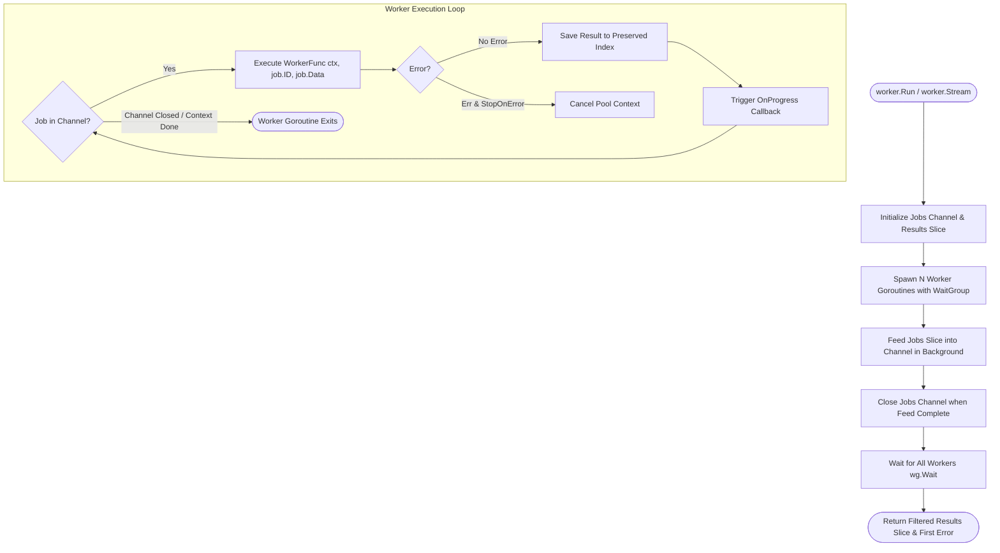

# Worker Pool (`/worker`)

Generic concurrent worker pool with context cancellation, order preservation, and progress tracking.

## ⚙️ Worker Pool Lifecycle (Activity Diagram)



---

## 📖 Quickstart & Functional Options

### 1. Modern Execution (`worker.Run` with Options)

```go
import (
	"context"
	"fmt"
	"time"

	"github.com/Jkenyut/nvx-go-helper/worker"
)

jobs := []worker.Job[string, int]{
	{ID: "job-1", Data: 10},
	{ID: "job-2", Data: 20},
}

workerFn := func(ctx context.Context, id string, data int) (string, error) {
	return fmt.Sprintf("result-%d", data), nil
}

// Ergonomic execution with idiomatic functional options:
results, err := worker.Run(
	context.Background(),
	jobs,
	workerFn,
	worker.WithWorkers(4),
	worker.WithPreserveOrder(true),
	worker.WithWorkerTimeout(10*time.Second),
	worker.WithOnProgress(func(completed, total int) {
		fmt.Printf("Completed %d of %d\n", completed, total)
	}),
)
```

### 2. Stream Execution (`worker.Stream`)

```go
// Stream results as soon as each job completes:
outCh := worker.Stream(
	ctx,
	jobs,
	workerFn,
	worker.WithWorkers(4),
	worker.WithStopOnError(true),
)

for res := range outCh {
	if res.Err != nil {
		log.Printf("Job %s failed: %v", res.ID, res.Err)
		continue
	}
	log.Printf("Job %s finished: %v", res.ID, res.Value)
}
```
